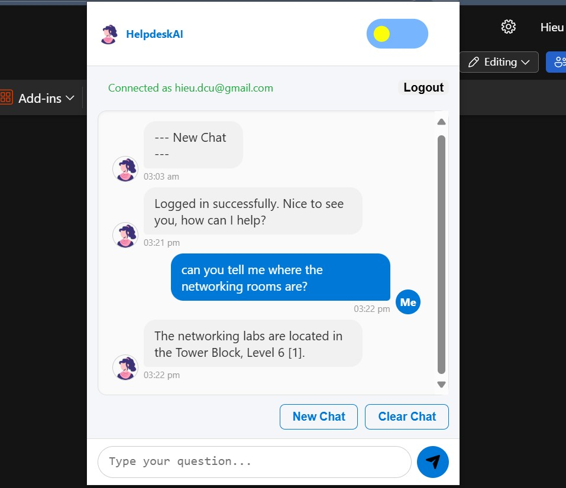

# helpdesk-extension
- brower extension for the openwebui virtual helpdesk (Gemma)
- go to edge://extensions/
- or chrome://extensions/
- enable developmer mode
- load the unpacked downloaded folder
- Or
- download from Chrome Web Store: https://chromewebstore.google.com/detail/helpdeskai/kelifpdecpnijnffdmljpidblbmgciah
- requires OpenVPN connection with Weltec School of IT (soit) and login credentials
- this extension use the assistant #1 - Gemma3:12b model with loaded knowledge
- knowledge source including Moodle internal access and official contents extracted from https://www.whitireiaweltec.ac.nz/ public access
- 
